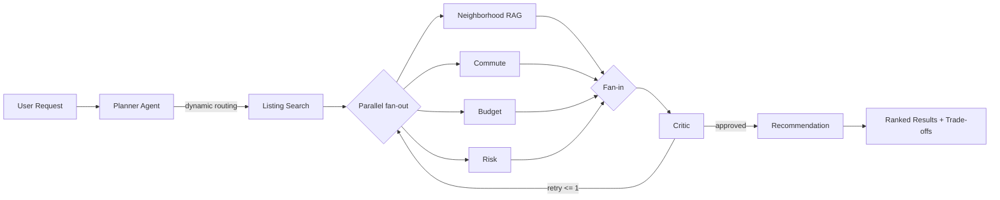
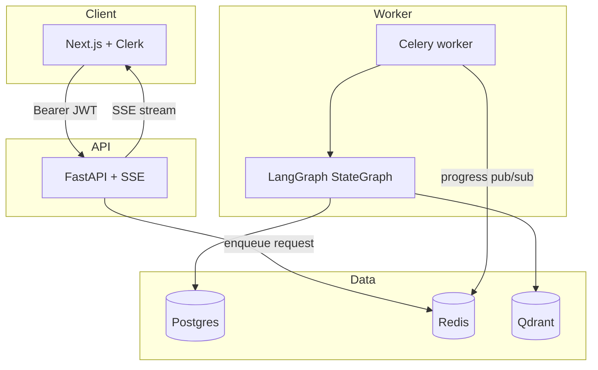

# Multi-Agent Housing Decision System

> A decision-intelligence system where a planner agent dynamically routes a housing request to only the specialist agents it needs, runs independent specialists in parallel, asks a critic agent to review the combined output, and produces ranked recommendations with explicit trade-off reasoning. This is not a chatbot wrapper; it is a stateful multi-agent graph with memory, tool use, evaluation, and observability.

**Live demo:** https://web-ph6nspsiw-doantriet2005-8192s-projects.vercel.app
**Repo:** https://github.com/DoanTriett/housing-decision-system

## Problem

Apartment hunting is a multi-constraint decision problem: price, commute, safety, noise, amenities, pets, and listing risk all interact. Listing sites return long feeds; chatbots return prose. This project makes the reasoning inspectable by showing which agents ran, what each found, and which trade-offs drove the final ranking.

## Architecture





## Tech Stack

| Layer | Choice |
| --- | --- |
| Orchestration | LangGraph StateGraph with conditional routing, parallel fan-out, and bounded retry |
| LLM abstraction | LiteLLM with structured tool calls, retries, token/cost/latency tracking |
| Models | OpenAI `gpt-4.1-mini` for planner, specialists, critic, recommendation, and judge calls |
| API | FastAPI, Pydantic v2, SSE via `sse-starlette`, Clerk JWT auth, SlowAPI rate limits |
| Background work | Celery + Redis broker/result backend |
| Data | Postgres via SQLAlchemy/Alembic, Redis cache/pub-sub, Qdrant vector search |
| External tools | Voyage embeddings, Google Maps commute calls, Nominatim geocoding |
| Frontend | Next.js 14 App Router, TypeScript, Tailwind, shadcn/ui, Clerk, Leaflet, Recharts |
| Evaluation | 40-example golden dataset, routing F1, constraint-match metric, LLM-as-judge score |
| Observability | Persisted AgentRun latency/cost rows, dashboard, optional LangSmith tracing |

## Key Design Decisions

**Graph orchestration instead of a fixed chain.** The planner produces an `ExecutionPlan`, and LangGraph conditional edges invoke only the selected specialists. This proves different requests produce different execution graphs. The trade-off is that planner mistakes can skip useful agents, so routing is measured by the eval harness and reviewed by the critic.

**Listing search before parallel specialists.** Every specialist needs candidates, so listing search runs first. After that, neighborhood, commute, budget, and risk are independent and can run in parallel. This keeps latency lower than a purely sequential pipeline while preserving a simple state contract.

**Bounded critic reflection.** The critic checks constraint coverage, contradictions, and unsupported claims. It can request one targeted retry. The cap is intentional: reflection helps quality, but uncapped loops are risky for cost and latency.

**Celery plus SSE for user experience.** A full graph can take tens of seconds. The API returns `202 Accepted`, the worker runs the graph, Redis carries progress events, and the browser streams live agent updates. The trade-off is that Redis pub/sub is not durable, so mid-run refreshes do not replay old events.

**Adapter pattern for tools.** Listings, commute, and vector search are behind provider interfaces. That keeps tests fast and lets the synthetic dataset be replaced with a real listings API later without rewriting agent logic.

**Structured outputs at agent boundaries.** Planner decisions, specialist findings, critic reviews, and recommendations use Pydantic schemas and tool-calling outputs. This reduces brittle free-form parsing and makes persistence/evaluation straightforward.

## Eval Results

Day 13 full eval on 40 golden examples:

| Metric | Result |
| --- | --- |
| Routing F1 | 0.9922 |
| Constraint-satisfaction match rate | 0.8750 |
| LLM-as-judge mean quality | 3.63 / 5 |
| Full eval cost | about $0.15 |
| Full eval wall clock | 514 seconds |
| Backend tests | 60 passing |
| Coverage | 68.13% (`fail_under=55`) |

The strong routing F1 is the main quality signal for dynamic routing. Constraint match and judge score are useful but imperfect: 5 of 40 examples disagree with the expected constraint label, and explanation quality still varies. CI runs a smaller eval subset with deliberately looser gates to avoid flakiness; the full eval report is the better quality snapshot.

## Known Limitations

- `/admin/observability` has no real admin role gate yet; any authenticated user can view it.
- Stale `pending` requests are detected in history and observability, but there is no automatic sweeper or task timeout that marks them failed. A dead Celery worker still requires manual intervention.
- Constraint match is 87.5%, not 100%, on the golden eval set.
- LLM-as-judge quality averages 3.63 / 5, so the README should not imply every explanation is excellent.
- Local Windows development used Celery `--pool=solo`, which is sequential. Real concurrency must be verified after Linux production deployment with the prefork worker.
- The golden dataset is tuned to the seeded Austin / UT Austin geography, so it should not be treated as proof of general multi-city quality.

## Local Setup

Prerequisites: Python 3.12, `uv`, Node 20+, Docker Compose, and API keys for OpenAI, Voyage, Google Maps, and Clerk.

```bash
docker compose -f infra/docker-compose.yml up -d
cp .env.example apps/api/.env
```

Fill `apps/api/.env`, then run:

```bash
cd apps/api
uv sync
uv run alembic upgrade head
uv run python scripts/seed_db.py
uv run python scripts/seed_vector_db.py
```

Start the backend and worker:

```bash
# Terminal A - worker on Windows
cd apps/api
uv run celery -A src.worker.celery_app:celery_app worker --loglevel=info --pool=solo

# Terminal B - API
cd apps/api
uv run uvicorn src.main:app --reload --port 8000
```

Start the frontend:

```bash
cd apps/web
cp .env.local.example .env.local
npm install
npm run dev
```

Open `http://localhost:3000`, sign in, and submit a new request.

Optional LangSmith tracing:

```bash
LANGCHAIN_TRACING_V2=true
LANGCHAIN_API_KEY=...
LANGCHAIN_PROJECT=housing-decision-system
```

## Testing

```bash
cd apps/api
uv run ruff check .
uv run mypy src
uv run pytest -v --cov=src --cov-report=term-missing

# Full eval: slower and uses LLM calls
uv run python eval/run_eval.py

# CI subset
uv run python eval/run_eval.py --ci --skip-judge
```

Frontend:

```bash
cd apps/web
npm run build
```

## Deployment

The intended production shape is:

| Service | Suggested host |
| --- | --- |
| Postgres | Neon |
| Redis | Upstash |
| Qdrant | Qdrant Cloud |
| API | Railway |
| Celery worker | Separate Railway worker service |
| Frontend | Vercel |
| Tracing | LangSmith |

See [docs/DEPLOYMENT.md](docs/DEPLOYMENT.md) for the deployment notes. Production secrets are set through Railway/Vercel and are not committed.

## Demo Video

Record a 2-3 minute screen demo against the live URL. The most important clip is two contrasting requests that show visibly different agent execution graphs. Use [docs/DEMO_SCRIPT.md](docs/DEMO_SCRIPT.md).

## Future Improvements

- Add admin RBAC for observability.
- Add Celery task time limits and a periodic stale-pending sweeper.
- Improve constraint-match and judge scores with better labels, seed data, and prompts.
- Replace synthetic listings with a real listings API behind `ListingsProvider`.
- Add multi-city support.
- Add user feedback loops for online eval and re-ranking.
- Add roommate / multi-stakeholder decision mode.
