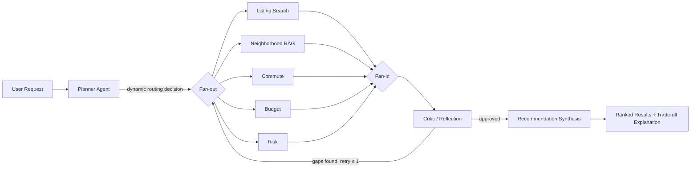
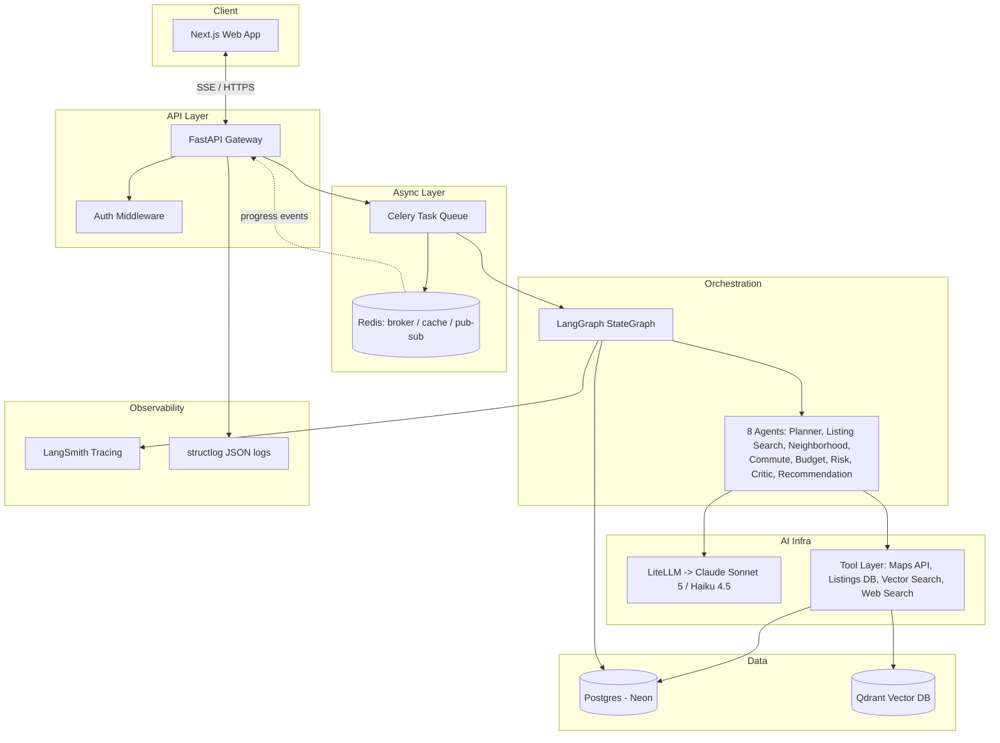

# Multi-Agent Housing Decision System

### Complete Implementation Roadmap for an AI Engineering Internship Portfolio Project

**Positioning statement (put this in your README and repeat it in interviews):**

> "I built a decision-intelligence system where a planner agent dynamically routes a housing request to only the specialist agents it actually needs, runs them in parallel, has a critic agent reflect on the combined output, and produces a ranked recommendation with explicit trade-off reasoning — not a chatbot wrapper, a stateful multi-agent graph with memory, tool use, evaluation, and observability."

That sentence alone signals graph-based orchestration, dynamic control flow, parallelism, reflection, memory, tools, evals, and observability — the exact vocabulary that shows up in AI Engineer / Applied AI job descriptions at Anthropic, OpenAI, Google, Microsoft, Meta, Amazon, and NVIDIA.

---


## 1. Project Pipeline


### High-level flow




### Narrative walkthrough

1. **Intake.** User submits a structured + free-text request (budget, location anchor, hard constraints like pet-friendly/laundry, soft preferences like "quiet").
2. **Planning (dynamic, not fixed).** The Planner agent reads the request and produces an `ExecutionPlan`: which of the 5 specialist agents are actually relevant, plus per-agent sub-goals. This is the core "not a fixed pipeline" requirement — implemented as **conditional edges** in a LangGraph state machine, not an `if/else` prompt trick.
3. **Parallel specialist execution (fan-out).** Only the selected specialists run, concurrently, because they're independent of each other (they all depend on the Planner's output and the candidate set, not on each other).
4. **Fan-in + Critic (reflection).** Once all selected specialists finish, a Critic agent reviews the combined state for contradictions, missing constraint coverage, and unsupported claims. If it finds a real gap, it can request **one** targeted re-run of a specific agent (bounded retry — no infinite loops, this is a deliberate cost/latency guardrail worth mentioning in interviews).
5. **Recommendation synthesis.** Aggregates everything into a ranked top-3 with an explicit trade-off narrative ("Apartment A is $50/mo cheaper but adds 8 minutes of walking versus Apartment B; Apartment C is closest but flagged for a below-market price, which the Risk agent treats as a caution signal").
6. **Delivery + persistence.** Result is streamed to the client via SSE as it's produced, the full run (inputs, per-agent outputs, latencies, token costs, trace) is persisted for history/observability/eval, and long-term memory is updated with any durable preferences the user expressed.


### Example trace (why dynamic routing matters)

Given the sample request in the prompt (budget, near university, <20 min walk, safe, laundry, pet-friendly, quiet):

- Planner selects **all 5** specialists because every constraint maps to one.
- If a *different* user says "just show me anything under $1,200 near downtown," the Planner skips **Neighborhood**, **Risk**, and **Commute** entirely (no safety/quiet/commute constraint stated) and only runs **Listing Search** + **Budget** — a measurably different, cheaper, faster execution graph for a simpler request. This is the concrete evidence you show in a demo video to prove the system isn't hardcoded.

---


## 2. System Architecture




### Key architecture decisions (write these up as ADRs — Architecture Decision Records — interviewers love this)


| Decision                                                                                         | Why                                                                                                                          | Trade-off acknowledged                                                                            |
| ------------------------------------------------------------------------------------------------ | ---------------------------------------------------------------------------------------------------------------------------- | ------------------------------------------------------------------------------------------------- |
| Graph-based orchestration (LangGraph) instead of a fixed chain                                   | Planner needs **conditional branching**, parallel fan-out, and a bounded reflection loop — a linear chain can't express this | More setup complexity than a simple prompt chain; justified by the dynamic-routing requirement    |
| Specialist agents run in parallel, not sequentially                                              | They're mutually independent given the candidate set — sequential execution would triple latency for no benefit              | Requires careful state-merge design so concurrent writes to shared state don't clobber each other |
| Critic loop capped at 1 retry                                                                    | Reflection improves quality but uncapped retries risk runaway cost/latency in production                                     | Occasionally ships a slightly imperfect answer rather than looping forever                        |
| Pipeline runs as a background Celery task, results streamed via SSE                              | A full multi-agent run takes 10–40s; blocking an HTTP request that long is bad UX and bad infra practice                     | Adds a queue + pub/sub bridge instead of a simple request/response                                |
| Tool layer uses an adapter/repository pattern (`ListingsProvider`, `CommuteProvider` interfaces) | Lets you launch on a synthetic dataset and swap in a real listings API (e.g., RentCast) later without touching agent logic   | Extra abstraction layer for a project that currently has one implementation each                  |
| Structured outputs via Pydantic + tool-calling JSON schemas at every agent boundary              | Prevents the classic "LLM returns almost-JSON" failure mode; makes the whole graph type-safe                                 | Slightly more prompt engineering upfront to get schema-following behavior right                   |


### Shared state schema (the backbone of the graph)

```python
class AgentState(TypedDict):
    request_id: str
    user_request: UserHousingRequest        # structured constraints + free text
    execution_plan: ExecutionPlan | None     # Planner's output
    candidates: list[ListingCandidate]       # from Listing Search
    neighborhood_findings: dict[str, NeighborhoodAssessment]
    commute_results: dict[str, CommuteResult]
    budget_analysis: dict[str, BudgetAnalysis]
    risk_flags: dict[str, RiskAssessment]
    critic_notes: CriticReview | None
    retry_count: int
    recommendation: RecommendationOutput | None
    trace: list[AgentTraceEvent]             # per-node latency/tokens/cost for observability
```


### The 8 agents


| Agent              | Type                                    | What it does                                                                                                                   |
| ------------------ | --------------------------------------- | ------------------------------------------------------------------------------------------------------------------------------ |
| **Planner**        | LLM + structured output                 | Reads the request, decides which specialists to invoke and why; produces the `ExecutionPlan`                                   |
| **Listing Search** | Tool-calling agent                      | Filters the listings dataset/DB by hard constraints (price, beds, pet policy, laundry)                                         |
| **Neighborhood**   | RAG agent                               | Retrieves neighborhood knowledge-base docs (safety, noise, vibe) from the vector DB and synthesizes a per-candidate assessment |
| **Commute**        | Tool-calling agent                      | Calls a routing API to compute walk/transit time from each candidate to the user's anchor location                             |
| **Budget**         | Deterministic + LLM wrapper             | Computes affordability math in code (not the LLM), then has the LLM explain it in plain language                               |
| **Risk**           | Rule-based + LLM reasoning + web search | Flags scam signals, below-market pricing, and (optionally) landlord reputation via web search                                  |
| **Critic**         | Reflection agent                        | Reviews the combined output for contradictions, unmet constraints, and unsupported claims; can trigger one bounded retry       |
| **Recommendation** | Synthesis agent                         | Produces the ranked top-3 with explicit trade-off narrative citing which specialist finding drove each ranking decision        |


### Memory (two layers, not a "memory agent")

- **Short-term (session):** LangGraph's Postgres-backed checkpointer persists graph state per session, so "actually raise my budget to $950" continues from prior state instead of restarting the whole pipeline.
- **Long-term (cross-session):** A `user_profile` table stores durable preferences learned across sessions (e.g., consistently rejects apartments without laundry), summarized periodically by an LLM call rather than growing unbounded.

---


## 3. Folder Structure

```
housing-decision-system/
├── apps/
│   ├── web/                          # Next.js frontend
│   │   ├── app/
│   │   ├── components/
│   │   ├── lib/
│   │   └── package.json
│   └── api/                          # FastAPI backend
│       ├── src/
│       │   ├── main.py
│       │   ├── config.py             # pydantic-settings
│       │   ├── api/
│       │   │   ├── routes/
│       │   │   │   ├── requests.py   # submit / stream / fetch results
│       │   │   │   ├── auth.py
│       │   │   │   └── admin.py      # observability dashboard endpoints
│       │   │   └── deps.py
│       │   ├── agents/
│       │   │   ├── base.py
│       │   │   ├── state.py
│       │   │   ├── planner.py
│       │   │   ├── listing_search.py
│       │   │   ├── neighborhood.py
│       │   │   ├── commute.py
│       │   │   ├── budget.py
│       │   │   ├── risk.py
│       │   │   ├── critic.py
│       │   │   ├── recommendation.py
│       │   │   └── graph.py          # LangGraph StateGraph wiring
│       │   ├── tools/
│       │   │   ├── base.py           # Tool interface
│       │   │   ├── maps.py           # OpenRouteService adapter
│       │   │   ├── listings_repo.py  # DB / synthetic dataset adapter
│       │   │   └── vector_search.py  # Qdrant adapter
│       │   ├── llm/
│       │   │   ├── client.py         # LiteLLM wrapper + cost tracking
│       │   │   └── prompts/
│       │   ├── models/               # SQLAlchemy ORM models
│       │   ├── schemas/              # Pydantic request/response/agent schemas
│       │   ├── db/
│       │   │   ├── session.py
│       │   │   └── migrations/       # Alembic
│       │   ├── memory/
│       │   │   ├── checkpointer.py
│       │   │   └── long_term.py
│       │   ├── worker/
│       │   │   ├── celery_app.py
│       │   │   └── tasks.py
│       │   └── observability/
│       │       ├── tracing.py        # LangSmith wiring
│       │       └── logging.py        # structlog config
│       ├── tests/
│       │   ├── unit/
│       │   ├── integration/
│       │   └── conftest.py
│       ├── eval/
│       │   ├── golden_dataset.jsonl
│       │   ├── run_eval.py
│       │   └── judges.py             # Claude-as-judge scoring
│       ├── scripts/
│       │   ├── seed_db.py
│       │   └── seed_vector_db.py
│       ├── pyproject.toml
│       ├── Dockerfile
│       └── alembic.ini
├── infra/
│   ├── docker-compose.yml
│   └── fly.toml
├── .github/workflows/
│   ├── ci.yml
│   └── deploy.yml
├── docs/
│   ├── architecture.md
│   ├── adr/
│   └── demo.gif
├── README.md
└── .env.example
```

---


## 4. Tech Stack


| Category                     | Recommended                                                                                                                               | Why it matters for AI Eng JDs                                                                                                                                      | Alternatives                                                                                                                                            |
| ---------------------------- | ----------------------------------------------------------------------------------------------------------------------------------------- | ------------------------------------------------------------------------------------------------------------------------------------------------------------------ | ------------------------------------------------------------------------------------------------------------------------------------------------------- |
| **Frontend**                 | Next.js 14 (App Router) + TypeScript + Tailwind + shadcn/ui                                                                               | Dominant stack for AI product UIs; TypeScript is a baseline expectation                                                                                            | Remix, SvelteKit                                                                                                                                        |
| **Backend**                  | Python + FastAPI (async)                                                                                                                  | The de facto standard for AI/ML APIs; native Pydantic + async + auto OpenAPI docs                                                                                  | Django + DRF (heavier, less AI-native)                                                                                                                  |
| **Agent framework**          | LangGraph                                                                                                                                 | Graph-based state machine is the right primitive for *dynamic* conditional routing + parallel fan-out + bounded reflection; extremely common in current AI Eng JDs | CrewAI (less control over routing), OpenAI Agents SDK, hand-rolled orchestrator (valid, more work, great "why not a framework" interview talking point) |
| **LLM provider abstraction** | LiteLLM, primary provider Anthropic Claude (Sonnet 5 for Planner/Critic/Recommendation, Haiku 4.5 for cheap high-volume specialist calls) | Shows awareness of provider-agnostic design, fallback, and cost-tiered model routing — a real production concern, not just prompting                               | Direct Anthropic SDK only (simpler, less "production abstraction" signal)                                                                               |
| **Database**                 | PostgreSQL (Neon serverless for prod, Docker locally)                                                                                     | Universal, and doubles as the checkpointer store for LangGraph memory                                                                                              | Supabase Postgres                                                                                                                                       |
| **Caching**                  | Redis (Upstash for prod, Docker locally)                                                                                                  | Caches commute API calls & embeddings, doubles as Celery broker and SSE pub/sub bus                                                                                | —                                                                                                                                                       |
| **Vector database**          | Qdrant (Docker locally, Qdrant Cloud free tier in prod)                                                                                   | Named vector DB experience reads well on a resume; used for the Neighborhood RAG knowledge base                                                                    | pgvector (fewer moving parts, valid trade-off to discuss)                                                                                               |
| **Observability**            | LangSmith (native LangGraph tracing) + structlog                                                                                          | Per-agent latency/token/cost tracing out of the box; structured JSON logs for the rest of the app                                                                  | OpenTelemetry (mention as the vendor-neutral alternative)                                                                                               |
| **Evaluation**               | Custom eval harness: golden dataset + routing-accuracy metric + constraint-satisfaction metric + Claude-as-judge quality score            | Directly demonstrates "evaluation" beyond vibes — a specifically requested skill in most Applied AI JDs                                                            | promptfoo, DeepEval, Braintrust (mention as tools you drew inspiration from)                                                                            |
| **Authentication**           | Clerk (fast Next.js integration)                                                                                                          | Gets you real multi-user auth without burning days                                                                                                                 | Plain JWT via FastAPI (`python-jose`) if you want more backend auth credit                                                                              |
| **Deployment**               | Frontend → Vercel; Backend → Fly.io/Railway (Docker); DB → Neon; Redis → Upstash; Vector DB → Qdrant Cloud                                | Standard modern deployment topology, all with generous free tiers                                                                                                  | Render, AWS ECS (heavier, more infra time)                                                                                                              |
| **CI/CD**                    | GitHub Actions (lint → type-check → test → eval subset → build → deploy)                                                                  | Table stakes; an eval-gated CI pipeline is a strong differentiator                                                                                                 | —                                                                                                                                                       |
| **Testing**                  | Pytest + pytest-asyncio + httpx (backend), Vitest + React Testing Library (frontend), Playwright (optional e2e)                           | Standard, expected                                                                                                                                                 | —                                                                                                                                                       |
| **Containerization**         | Docker + docker-compose for local multi-service dev                                                                                       | Universal expectation                                                                                                                                              | —                                                                                                                                                       |
| **Package manager**          | `uv` (Python, fast/modern — differentiating), `pnpm` (frontend)                                                                           | `uv` adoption in JDs is rising fast; shows current tooling awareness                                                                                               | pip-tools, npm                                                                                                                                          |
| **ORM**                      | SQLAlchemy 2.0 (async) + Alembic migrations                                                                                               | Standard for FastAPI backends                                                                                                                                      | SQLModel                                                                                                                                                |
| **Validation**               | Pydantic v2 everywhere — API schemas, `AgentState`, structured LLM outputs via tool-calling JSON schema                                   | Prevents the "LLM returns almost-JSON" failure class; core to reliable agent I/O                                                                                   | —                                                                                                                                                       |
| **Streaming**                | Server-Sent Events via FastAPI `StreamingResponse`, bridged from Celery via Redis pub/sub                                                 | Matches how real AI products stream (ChatGPT/Claude-style); simpler than WebSockets for one-directional progress                                                   | WebSockets if you want bidirectional                                                                                                                    |
| **Background jobs**          | Celery + Redis broker                                                                                                                     | A 10–40s multi-agent run belongs in a task queue, not blocking a request thread — genuine production pattern                                                       | Arq (lighter-weight async-native alternative)                                                                                                           |
| **Logging**                  | structlog (structured JSON) + request-ID correlation middleware                                                                           | Makes multi-agent runs traceable end-to-end in prod                                                                                                                | —                                                                                                                                                       |
| **Configuration management** | pydantic-settings + `.env` + per-environment config classes                                                                               | 12-factor config, secrets never committed                                                                                                                          | —                                                                                                                                                       |


---


## 5. Detailed Timeline (14 Days)

> **If you only have 7–10 days:** collapse Days 4–6 into one longer day by building Listing Search + Budget + Commute together (they're the simplest agents), skip Day 9's rate limiting, do a synchronous (non-Celery) pipeline instead of Day 8's background-job version, and cut Day 13's full eval suite down to just the golden dataset + routing-accuracy metric. Everything else stays — the dynamic Planner, parallel fan-out, Critic loop, and a working deployed demo are the non-negotiable core.


### Week 1 — Core Multi-Agent Backend

**Week goal:** by end of Day 7, you can run the full 8-agent graph end-to-end from a script and get a real, correct, trade-off-explained recommendation — no API or frontend yet.

#### Day 1 — Project Setup & Foundations

- **Goal:** A running, linted, CI-checked skeleton with all infra containers up.
- **Features:** monorepo scaffold, Docker Compose (Postgres, Redis, Qdrant), FastAPI health check, structured logging, config management, pre-commit hooks, first GitHub Actions workflow.
- **Step-by-step:**
  1. Create the monorepo structure from Section 3.
  2. `apps/api`: init with `uv`, add FastAPI, pydantic-settings, structlog; write `main.py` with a `/health` endpoint.
  3. Write `infra/docker-compose.yml` with Postgres, Redis, Qdrant services.
  4. Set up `ruff` + `mypy` + pre-commit hooks.
  5. Write `.github/workflows/ci.yml`: install deps, run `ruff check`, run `pytest` (even with zero tests, it should pass).
  6. Push repo, verify CI goes green.
- **Expected outcome:** `docker compose up` brings up all 3 infra services; `curl localhost:8000/health` returns 200.
- **Checkpoint:** CI is green on a fresh clone with no manual steps beyond `docker compose up` + one setup command.
- **Deliverables:** working skeleton repo, green CI badge.


#### Day 2 — Data Layer & Domain Models

- **Goal:** A seeded database and a populated vector knowledge base to build agents against.
- **Features:** SQLAlchemy models (Listing, UserRequest, AgentRun, Recommendation, UserProfile), Alembic migrations, synthetic listings dataset, neighborhood knowledge base in Qdrant.
- **Step-by-step:**
  1. Define ORM models in `models/` and matching Pydantic schemas in `schemas/`.
  2. Set up Alembic, generate + run initial migration.
  3. Write `scripts/seed_db.py`: generate 200–500 realistic synthetic listings for one city (e.g., Austin, TX near UT Austin) using Faker for names/descriptions layered onto real neighborhood names and coordinates. Include price, beds, lat/lon, amenities (laundry, pet policy), description text.
  4. Write ~15–20 short neighborhood profile documents (safety, noise level, walkability, vibe) for that city's real neighborhoods.
  5. Embed them (Voyage AI embeddings, Anthropic's recommended embedding partner) and upsert into a Qdrant collection.
  6. Write `scripts/seed_vector_db.py` to automate this.
- **Expected outcome:** Postgres has realistic listing data; Qdrant has a queryable neighborhood knowledge base.
- **Checkpoint:** A scratch script can query Qdrant for "quiet, safe neighborhood" and get sensible neighborhood docs back.
- **Deliverables:** seeded DB, populated vector DB, both reproducible via one script each.


#### Day 3 — LLM Abstraction & Planner Agent

- **Goal:** First working agent, with the provider abstraction and shared state schema in place.
- **Features:** LiteLLM wrapper with cost/latency tracking, `AgentState` schema, Planner agent with structured output.
- **Step-by-step:**
  1. Build `llm/client.py`: wraps LiteLLM calls, records tokens + latency + estimated cost per call, supports retries/timeouts.
  2. Define `AgentState` (TypedDict) and per-agent Pydantic I/O schemas (`ExecutionPlan`, etc.).
  3. Write the Planner prompt: given the user request, decide which of the 5 specialists are relevant and why, output via tool-calling forced to the `ExecutionPlan` schema.
  4. Write unit tests with mocked LLM responses covering at least 3 distinct routing scenarios (all agents needed, minimal agents needed, one edge case).
- **Expected outcome:** Given the sample request from the prompt, Planner selects all 5 specialists with correct reasoning; given a minimal request, it correctly skips several.
- **Checkpoint:** manually verify 3+ example requests produce sensible, *different* execution plans.
- **Deliverables:** working Planner agent + passing unit tests demonstrating dynamic routing.


#### Day 4 — Specialist Agents Batch 1: Listing Search + Budget

- **Goal:** Two working specialists, one tool-calling and one deterministic.
- **Features:** `ListingsProvider` adapter interface + DB-backed implementation, Listing Search agent, Budget agent (deterministic math + LLM explanation).
- **Step-by-step:**
  1. Define `tools/base.py` `Tool` interface; implement `listings_repo.py` filtering by hard constraints.
  2. Listing Search agent calls this tool, returns top-N candidates.
  3. Budget agent: compute affordability metrics in plain Python (not the LLM), then a short LLM call turns the numbers into a one-paragraph explanation per candidate.
  4. Unit + integration tests for both.
- **Expected outcome:** given the example request, Listing Search returns a filtered candidate set; Budget agent scores each candidate's affordability correctly.
- **Checkpoint:** filtering logic is verifiably correct against hand-computed expected results for 2–3 test listings.
- **Deliverables:** 2 working, tested specialist agents.


#### Day 5 — Specialist Agents Batch 2: Neighborhood + Commute

- **Goal:** RAG-based agent and external-API tool-calling agent.
- **Features:** Neighborhood agent (Qdrant retrieval + LLM synthesis), Commute agent (OpenRouteService routing API + Nominatim geocoding).
- **Step-by-step:**
  1. Neighborhood agent: embed the user's safety/noise-related constraints, retrieve top-k docs per candidate's neighborhood from Qdrant, synthesize a per-candidate safety/noise assessment with citations back to the source doc.
  2. Commute agent: geocode the user's anchor location (Nominatim, free), call OpenRouteService (free tier, no billing setup needed) for walking time from each candidate to the anchor.
  3. Add Redis caching for commute API calls (same listing → same anchor shouldn't re-call the API).
  4. Tests for both, including a cache-hit test for Commute.
- **Expected outcome:** candidates are enriched with both a neighborhood safety narrative and a real walk-time number.
- **Checkpoint:** commute numbers are sane (spot-check 2 known Austin addresses against Google Maps manually).
- **Deliverables:** 2 more working, tested specialist agents; caching demonstrated.


#### Day 6 — Specialist Agent 3 + Critic + Graph Wiring

- **Goal:** All 8 agents exist and are wired into a real LangGraph state machine.
- **Features:** Risk agent, Critic agent, full `graph.py` with conditional fan-out/fan-in and bounded reflection loop.
- **Step-by-step:**
  1. Risk agent: rule-based flags (price far below neighborhood median) + LLM reasoning over the listing description for scam-language patterns; optionally use a web-search tool call for landlord reputation.
  2. Critic agent: given the full accumulated state, checks each user constraint is addressed, flags contradictions between agents, and can emit a single targeted "re-run agent X" instruction.
  3. Build `graph.py`: `StateGraph(AgentState)` with the Planner as entry node, conditional edges routing to only the selected specialists (parallel branches), a fan-in join, the Critic node, a conditional edge back to a specific specialist (capped via `retry_count`), and a terminal edge to Recommendation (built tomorrow, stub it for now).
- **Expected outcome:** running the graph on the example request executes Planner → parallel specialists → Critic, with correct conditional routing.
- **Checkpoint:** trace the `trace: list[AgentTraceEvent]` field after a run and confirm only the selected agents actually executed.
- **Deliverables:** all 8 agents exist; graph compiles and runs end-to-end (recommendation stubbed).


#### Day 7 — Recommendation Agent + Memory + Week 1 Milestone

- **Goal:** Full pipeline produces a real, explained recommendation; session + long-term memory work.
- **Features:** Recommendation/Synthesis agent, LangGraph Postgres checkpointer, long-term `user_profile` memory table.
- **Step-by-step:**
  1. Recommendation agent: given the full state, rank the top-3 candidates and generate an explicit trade-off narrative that cites which specialist's finding drove each point (e.g., "Risk flagged X as below-market").
  2. Wire the Postgres checkpointer into the graph so a `thread_id` persists state across turns.
  3. Add a `user_profile` table + a small routine that, after each run, extracts durable preferences and upserts them.
  4. Write an end-to-end CLI script: input the example request → run full graph → print structured recommendation.
  5. Manually run a second, refining request ("raise budget to $950") in the same thread and confirm it continues rather than restarts.
- **Expected outcome:** the CLI script produces a genuinely good, well-explained recommendation for the example request.
- **Checkpoint (Week 1 milestone):** full pipeline runs end-to-end from a script with no API/frontend, producing correct dynamic routing, parallel execution, at least one critic-triggered retry demonstrated in a test case, and a trade-off-explained recommendation.
- **Deliverables:** complete, demoable backend agent system.


### Week 2 — API, Frontend, Evaluation, Observability, Deployment

**Week goal:** by end of Day 14, you have a live deployed URL, a polished demo video, an eval suite running in CI, and a README good enough to link directly on your resume.

#### Day 8 — FastAPI Endpoints + Streaming

- **Goal:** The agent graph is reachable over HTTP with live progress streaming.
- **Features:** `POST /api/requests`, `GET /api/requests/{id}/stream` (SSE), `GET /api/requests/{id}`, Celery task wrapping the graph run, Redis pub/sub bridging worker progress to the SSE endpoint.
- **Step-by-step:**
  1. Set up `worker/celery_app.py` and a `run_pipeline` task that executes the graph and publishes `AgentTraceEvent`s to a Redis channel keyed by request ID as each node completes.
  2. `POST /api/requests` validates input (Pydantic), enqueues the Celery task, returns a request ID immediately.
  3. `GET /api/requests/{id}/stream` subscribes to the Redis channel and streams events via `StreamingResponse`.
  4. `GET /api/requests/{id}` returns the final persisted result once complete.
- **Expected outcome:** via curl/Postman: submit a request, watch live SSE events as each agent completes, fetch the final JSON.
- **Checkpoint:** SSE stream shows events in the correct order matching actual execution (parallel agents' events may interleave — that's correct and worth noting in your README).
- **Deliverables:** working streaming API.


#### Day 9 — Auth, Persistence, API Hardening

- **Goal:** A real, secured, documented multi-user API.
- **Features:** Clerk auth middleware, `AgentRun` persistence (full inputs/outputs/latency/cost per run), rate limiting, input validation hardening, OpenAPI docs.
- **Step-by-step:**
  1. Add Clerk JWT verification middleware to protected routes.
  2. On every pipeline run, persist an `AgentRun` row with per-agent latency/token/cost breakdown (pulled from the LLM client's tracking) and the full trace.
  3. Add Redis-based rate limiting per user.
  4. Tighten Pydantic schemas (max lengths, enum constraints on categorical fields) to reduce prompt-injection surface on free-text fields.
  5. Verify `/docs` (Swagger UI) is clean and complete.
- **Expected outcome:** authenticated, rate-limited, fully persisted API.
- **Checkpoint:** two different logged-in users see only their own request history.
- **Deliverables:** production-hardened API layer.


#### Day 10 — Frontend Scaffold + Request Form

- **Goal:** Users can submit a real request from a browser.
- **Features:** Next.js + TypeScript + Tailwind + shadcn/ui project, Clerk auth on frontend, request form matching the example request shape (budget, anchor location with autocomplete, constraint checkboxes/sliders).
- **Step-by-step:**
  1. Scaffold Next.js app, wire Clerk.
  2. Build the request form with proper client-side validation mirroring backend schemas.
  3. Wire form submission to `POST /api/requests`.
- **Expected outcome:** a logged-in user can submit the example request from the browser and receive a request ID back.
- **Checkpoint:** form validation errors match backend validation errors (no silent mismatches).
- **Deliverables:** working authenticated request form.


#### Day 11 — Live Agent Visualization

- **Goal:** A visually impressive live view of the multi-agent system working — this is your best demo-video moment.
- **Features:** animated execution graph showing agent nodes activating in real time as SSE events arrive, per-agent status/reasoning snippets.
- **Step-by-step:**
  1. Build a graph/node visualization component (cards or a node-link diagram) representing the 8 possible agents.
  2. Subscribe to the SSE stream; as events arrive, animate the corresponding node from idle → running → done, and surface a short status line per agent.
  3. Visually distinguish "this agent was skipped by the Planner" from "this agent ran" — this is the single clearest way to *show* dynamic routing rather than describe it.
- **Expected outcome:** submitting a request shows a real-time animated view of exactly which agents the Planner chose and their live progress.
- **Checkpoint:** run two different requests side by side (screen recording) and confirm visibly different execution graphs.
- **Deliverables:** the visual centerpiece of your demo video.


#### Day 12 — Results UI, Map, History, Observability Dashboard

- **Goal:** A polished results experience plus an internal-tooling page that doubles as observability proof.
- **Features:** ranked results cards with trade-off comparison table, map view (Leaflet/Mapbox) with commute overlay, request history page, admin observability dashboard (recent runs, per-agent latency, token cost).
- **Step-by-step:**
  1. Build the results page: top-3 cards, an explicit trade-off comparison table, expandable per-agent reasoning.
  2. Add a map showing candidate pins + the anchor location.
  3. Build `/history` pulling from `AgentRun`.
  4. Build `/admin/observability` showing latency and cost breakdowns per agent across recent runs (bar chart is enough).
- **Expected outcome:** end-to-end polished flow from form → live graph → results → history.
- **Checkpoint:** observability dashboard correctly reflects real recorded costs/latencies, not placeholder data.
- **Deliverables:** feature-complete frontend.


#### Day 13 — Evaluation Harness + Testing + CI Hardening

- **Goal:** Prove quality is measured, not assumed.
- **Features:** golden dataset (30–50 labeled requests), routing-accuracy metric, constraint-satisfaction metric, Claude-as-judge quality/faithfulness score, eval-gated CI, expanded test coverage.
- **Step-by-step:**
  1. Hand-write 30–50 diverse user requests in `eval/golden_dataset.jsonl`, each labeled with the expected set of agents the Planner should select.
  2. `eval/run_eval.py`: for each example, run the pipeline, compute (a) routing precision/recall against the label, (b) whether all stated hard constraints are satisfied in the top recommendation, (c) an LLM-judge score (0–5) for explanation quality and faithfulness to the underlying agent findings.
  3. Add `.github/workflows/ci.yml` step running a small eval subset (5–10 examples, to control cost) on every PR, posting a summary comment or failing the build below a quality threshold.
  4. Fill out unit/integration test coverage across agents, tools, and API routes; add `pytest-cov` reporting.
- **Expected outcome:** `python eval/run_eval.py` produces a report with concrete numbers (e.g., "94% routing accuracy, 100% hard-constraint satisfaction, 4.3/5 avg judge score").
- **Checkpoint:** intentionally break something (e.g., have Planner ignore the "pet friendly" constraint) and confirm the eval suite catches the regression.
- **Deliverables:** working eval harness with real numbers, CI gate, test coverage report.


#### Day 14 — Deployment, Full Observability, README, Demo Polish

- **Goal:** A live, public, professionally documented project.
- **Features:** production deployment across all services, end-to-end LangSmith tracing, polished README with architecture diagrams and demo video, final UX polish.
- **Step-by-step:**
  1. Deploy backend (Fly.io/Railway, Dockerized), frontend (Vercel), DB (Neon), Redis (Upstash), Qdrant (Qdrant Cloud).
  2. Wire LangSmith tracing in production; confirm traces show up per run with full per-agent breakdowns.
  3. Write the README: problem statement, architecture diagram (reuse the mermaid diagrams from this doc), tech stack table, eval results, setup instructions, "design decisions & trade-offs" section, link to demo video.
  4. Record a 2–3 minute demo video: submit two contrasting requests, show the live agent graph differ, show the trade-off explanation, show the eval report and observability dashboard.
  5. Final pass: loading states, empty states, error states; tag `v1.0`.
- **Expected outcome:** a stranger can open your GitHub repo, read the README, watch the video, and fully understand what you built and why, without asking you anything.
- **Checkpoint:** send the live URL + repo to a friend with zero context and see if they can explain the system back to you in one sentence.
- **Deliverables:** live public demo, `v1.0` tagged repo, demo video, resume-ready README.

---


## 6. Feature Tiers


### MVP — must build (this is the floor; do not ship without these)

- Planner agent with genuinely dynamic routing (proven via at least 2 contrasting example traces)
- All 5 specialist agents: Listing Search, Neighborhood, Commute, Budget, Risk
- Critic agent with at least one demonstrable bounded-retry case
- Recommendation agent with explicit trade-off narrative
- LangGraph orchestration with real parallel fan-out/fan-in
- Synthetic listings dataset + Qdrant-backed neighborhood RAG
- FastAPI backend with SSE streaming
- Basic Next.js frontend: request form + results page with trade-off explanation
- Postgres persistence of every run (inputs, outputs, trace)
- Basic auth
- Docker Compose local dev environment
- CI running lint + tests
- README with architecture explanation and at least one diagram


### Nice-to-have — build if on pace (this is where the project goes from "good" to "stands out")

- Live animated agent execution visualization (Day 11)
- Full evaluation harness with golden dataset + CI-gated eval (Day 13)
- End-to-end LangSmith tracing
- Long-term cross-session user memory
- Map visualization with commute overlay
- Observability dashboard page
- Rate limiting
- Multi-turn refinement via session checkpointing
- Celery-based background job execution (vs. simple synchronous request/response)


### Future improvements — don't build, just write down in a "Roadmap" section of the README

- Real listings API integration (e.g., RentCast) replacing the synthetic dataset, behind the existing `ListingsProvider` adapter
- Multi-city support
- Online eval feedback loop from real user thumbs-up/down signals
- Distilling the LLM-based Planner into a small fine-tuned routing classifier for cost/latency (great "I understand the cost/quality trade-off of LLMs vs. smaller models" talking point)
- Human-in-the-loop re-ranking from accumulated feedback
- Multi-modal input: photo of a listing → vision agent extracts structured data
- Multi-stakeholder mode: roommates with different, possibly conflicting constraints, negotiated by an additional coordination agent

---


## Bonus: Resume Bullet Points (fill in real numbers once you have eval results)

- Designed and built a multi-agent decision-intelligence system using a graph-based orchestration framework (LangGraph), where a planner agent dynamically routes requests to 1–5 specialist agents based on parsed constraints, cutting unnecessary LLM calls by [X]% versus a fixed pipeline on the eval set.
- Implemented a bounded reflection loop where a critic agent reviews specialist outputs for constraint coverage and contradictions, triggering targeted re-execution in [X]% of runs on the golden eval set.
- Built an evaluation harness (routing accuracy, constraint satisfaction, LLM-as-judge quality scoring) integrated into CI, catching agent-quality regressions before merge.
- Built a production-style backend (FastAPI, Celery, Redis, Postgres, SSE streaming) supporting real-time multi-agent progress updates to the client during 10–40s pipeline runs.
- Instrumented per-agent latency, token usage, and cost tracking via LangSmith and a custom observability dashboard, enabling cost-aware model tiering (Claude Sonnet for reasoning-heavy agents, Haiku for high-volume specialist calls).

